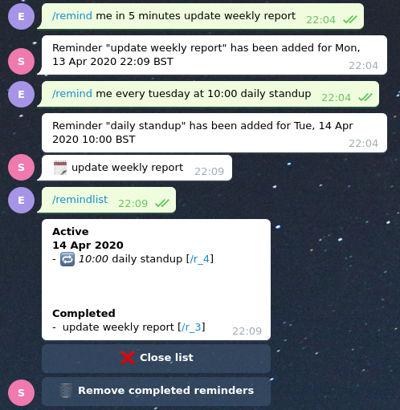

# Telegram Reminder Bot

Telegram bot that allows you to set reminders for a personal or group chat. Inspired by [Slack reminders](https://slack.com/intl/en-gb/help/articles/208423427-Set-a-reminder).  
Uses [robfig/cron](https://github.com/robfig/cron) for scheduling tasks, [tucnak/telebot](https://github.com/tucnak/telebot/tree/v2) and [enrico5b1b4/tbwrap](https://github.com/enrico5b1b4/tbwrap) for interacting with the telegram api, [etcd-io/bbolt](https://github.com/etcd-io/bbolt) for local storage of reminders.



## Usage

```
go build  

DB_FILE=local.db \  
TELEGRAM_BOT_TOKEN=<TELEGRAM_BOT_TOKEN> \
ALLOWED_CHATS=123456,567890 \
./telegram-bot
```

## Commands

### Remind list
Retrieve the list of active and completed reminders  
`/remindlist`

### Remind help
List all commands  
`/remindhelp`

### Remind detail
Display details of a reminder  
`/reminddetail 1`

### Remind on a date
Set a reminder in the format `[who] [when] [what]`

#### Fixed times and dates
- `/remind me at 21:00 update weekly report`  
- `/remind me on the 1 of december 2020 at 8:23 update weekly report`  
`/remind me on the 1st of december 2020 at 8:23 update weekly report`  
- `/remind me on the 1 of december 2020 update weekly report`  
`/remind me on the 1st of december 2020 update weekly report`  
- `/remind me in 4 minutes update weekly report`  
- `/remind me in 5 hours update weekly report`  
- `/remind me in 3 days update weekly report`  
- `/remind me in 3 hours, 4 minutes update weekly report`  
- `/remind me in 5 days, 3 hours, 4 minutes update weekly report`  
- `/remind me tonight update weekly report`  
`/remind me tonight at 21:20 update weekly report`  
`/remind me tomorrow morning update weekly report`  
`/remind me tomorrow at 16:45 update weekly report`  
- `/remind me on tuesday update weekly report`  

#### Recurring
- `/remind me every tuesday update weekly report`  
`/remind me every tuesday at 8:23 update weekly report`  
- `/remind me every 1st of the month at 8:23 update weekly report`  
`/remind me every 1 of the month at 8:23 update weekly report`  
- `/remind me every 1st of the month update weekly report`  
`/remind me every 1 of the month update weekly report`  
- `/remind me every 1st of december at 8:23 update weekly report`  
`/remind me every 1 of december at 8:23 update weekly report`  
- `/remind me every 1st of december update weekly report`  
`/remind me every 1 of december update weekly report`  
- `/remind me every 2 minutes update weekly report`  
- `/remind me every 3 hours, 4 minutes update weekly report`  
- `/remind me every 5 days, 3 hours, 4 minutes update weekly report`  